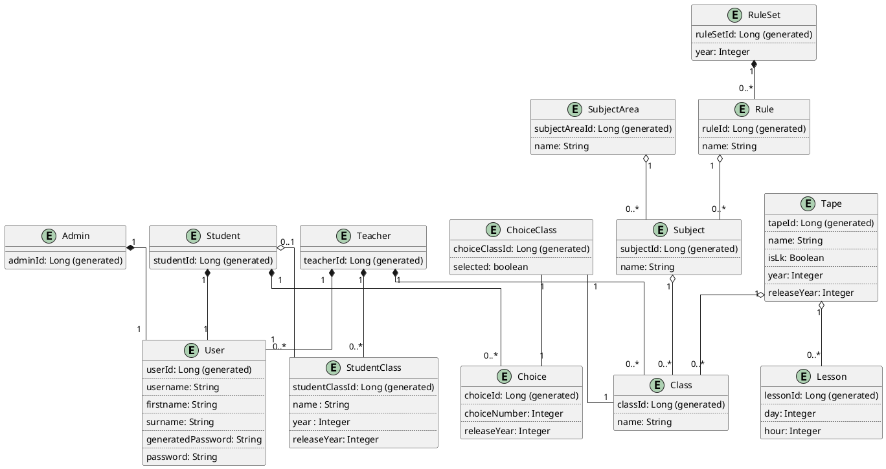

# Datenbank Aufbau

```plantuml
@startuml
skinparam linetype ortho

entity User {
userId: Long (generated)
..
username: String
..
firstname: String
..
surname: String
..
generatedPassword: String
..
password: String
}

entity Admin {
adminId: Long (generated)
}

entity Student {
studentId: Long (generated)
}

entity Teacher {
teacherId: Long (generated)
}

entity StudentClass {
studentClassId: Long (generated)
..
name : String
..
year : Integer
..
releaseYear: Integer
}

entity SubjectArea {
subjectAreaId: Long (generated)
..
name: String
}

entity Subject {
subjectId: Long (generated)
..
name: String
}

entity Class {
classId: Long (generated)
..
name: String
}

entity Tape {
tapeId: Long (generated)
..
name: String
..
isLk: Boolean
..
year: Integer
..
releaseYear: Integer
}

entity Lesson {
lessonId: Long (generated)
..
day: Integer
..
hour: Integer
}

entity Choice {
choiceId: Long (generated)
..
choiceNumber: Integer
..
releaseYear: Integer
}

entity RuleSet {
ruleSetId: Long (generated)
..
year: Integer
}

entity Rule {
ruleId: Long (generated)
..
name: String
}

entity ChoiceClass {
choiceClassId: Long (generated)
..
selected: boolean
}

Admin "1" *-- "1" User

Student "1" *-- "1" User

Teacher "1" *-- "1" User

Teacher "1" *-- "0..*" StudentClass

Teacher "1" *-- "0..*" Class

RuleSet "1"*-- "0..*" Rule

Rule "1" o-- "0..*" Subject

SubjectArea "1" o-- "0..*" Subject

Subject "1" o-- "0..*" Class

Tape "1" o-- "0..*" Class

Tape "1" o-- "0..*" Lesson

Student "0..1" o-- "0..*" StudentClass

Student "1" *-- "0..*" Choice

ChoiceClass "1" -- "1" Choice

ChoiceClass "1" -- "1" Class

@enduml
```